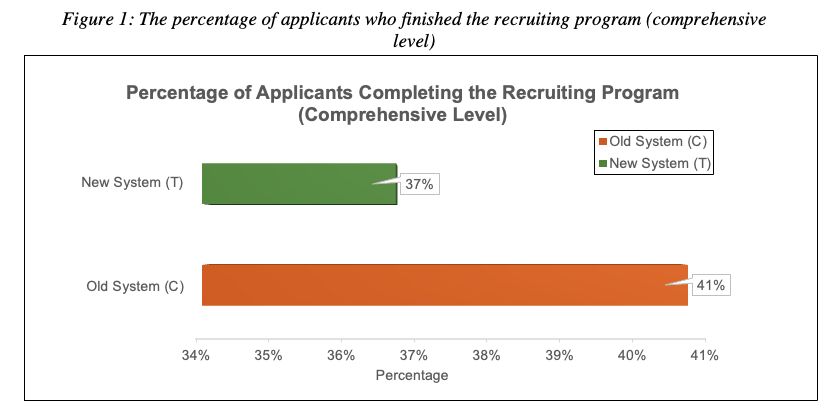
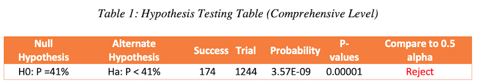
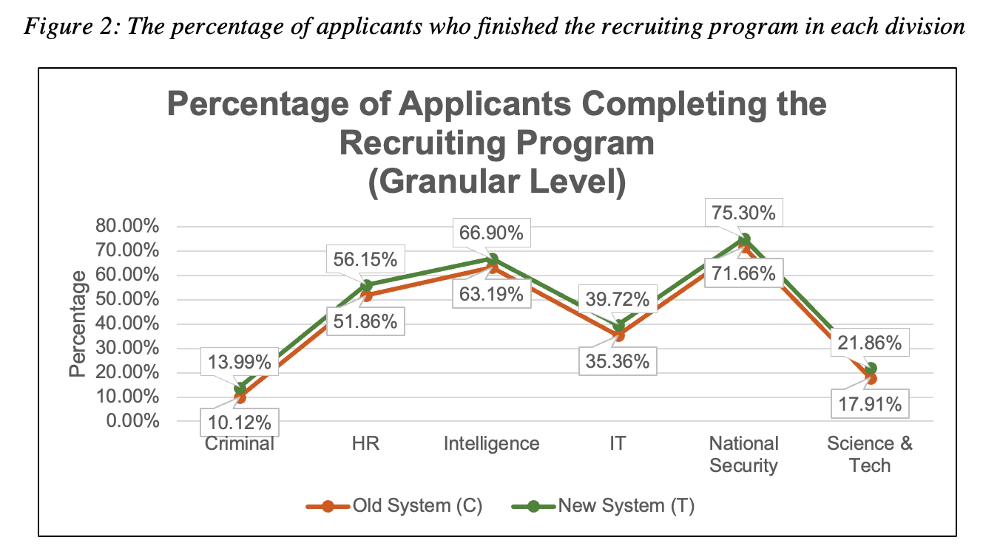
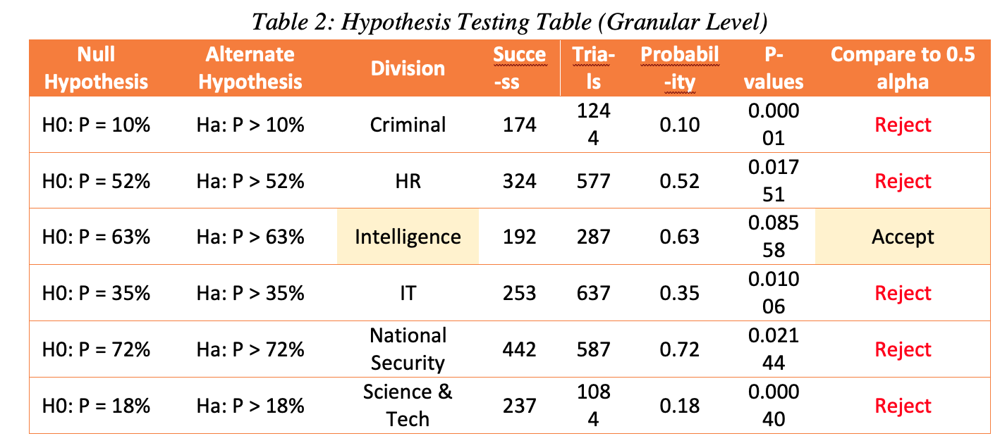

# FBI Recruiting System

## Project Overview 
The Federal Bureau of Investigation always recruit new agents for many divisions within their bureau. However, many recruits do not complete their program and drop off somewhere within the recruiting processes. The FBI wants to resolve this problem by setting up a controlled experiment. Some applicants will be assigning with the old system (C) and some applicants with the new system (T). 
#### Main Agenda: 
* Find out which system is better at retaining the applicants to fully complete their program using **hypothesis testing**
* Whether the new system is more effective at graduating recruits, compared to the old system. 
#### Data Description: 
* A unique recruit ID (eight random numbers)
* Division (IT, criminal, HR or National Security)
* Group (T or C)
* Step (application, background check, aptitude assessment, academy graduation or weapons training)
* Step date (what month, date, year that the step was taken)

## Approach
**Step 1**: Calculate each system’s success rate (comprehensive level). Compare the effectiveness of the new system through (not consider divisions). 
**Success Rate** = Total of Recruits in Weapon Training/Total of Recruits in Application

**Step 2**: Compare whether T or C has a better success rate on a comprehensive level. To prove this statement, we conduct a hypothesis test to assess the plausibility of our claim. 

**Notes**: Only analyzing the success rate on a comprehensive level is not enough to draw conclusion to our analysis. Since different divisions carry different number of total recruits who applied and number of total recruits who graduated.

**Step 3**: Therefore, we repeat step 1. This time, it's by division (granular level). At this stage, we calculate each system’s success rate from each division.

**Step 4**: Repeat step 2 by comparing whether T or C has a better success rate depending on each division. To prove this statement, we conduct a hypothesis test to assess the plausibility of our claim for each division.

## Results 

The comparison above (Figure 1) leads us to our first hypothesis testing (Table 1). 

Since we are comparing the new system to the old system, in the table above, our null hypothesis (no special event to see here) is the probability of having a success rate of 41%. With the hypothesis testing result, we can safely conclude that the new system is indeed worse than the old system on a comprehensive level. 

On the granular level (Figure 2), we have the success rate between T and C system on granular level. Overall, the trend shows that new system has a higher success rate across all divisions. The result above (Figure 2) leads us to our second hypothesis test (Table 2). 
 
 
 
The result from the hypothesis testing is that five out of six division (criminal, HR, IT, national security, science & tech) reject the null hypothesis. Only intellgience division accepts the null hypothesis. This outcome shows that according to the five divisions (criminal, HR, IT, national security, science & tech), old system is worse than the new system. According to the intelligence division, the new system is worse than the old system.

## Conclusion
Hypothesis testing on a **comprehensive level** confirms that the **old system is more effective at graduating recruits**. However, the hypothesis testing on **granular level** confirms that the **new system is more effective**. Since the application process requires applicants to apply through divisions, if the FBI eventually wants to implement a new recruiting model, the team should **use the new system instead of the old system.**

